# AnimeHub

AnimeHub is an anime streaming app that provides high-quality streaming of your favorite anime shows.
It's designed to be easy to use, so you can quickly find the anime you want to watch and start
streaming. if you're a die-hard anime fan or a casual
viewer, AnimeHub has something for everyone.

**Disclaimer:**

Any legal issues regarding the content on this application should be taken up with the actual file
hosts and providers themselves as we are not affiliated with them.

In case of copyright infringement, please directly contact the responsible parties or the streaming
websites.

The app is purely for educational and personal use.

AnimeHub does not host any content on the app, and has no control over what media is put up or taken
down. AnimeHub functions like any other search engine, such as Google. AnimeHub does not host, upload
or manage any videos, films or content. It simply crawls, aggregates and displayes links in a
convenient, user-friendly interface.

It merely scrapes 3rd-party websites that are publicly accessable via any regular web browser. It is
the responsibility of user to avoid any actions that might violate the laws governing his/her
locality. Use AnimeHub at your own risk.

### 📱 Screenshots
## Dark Theme

[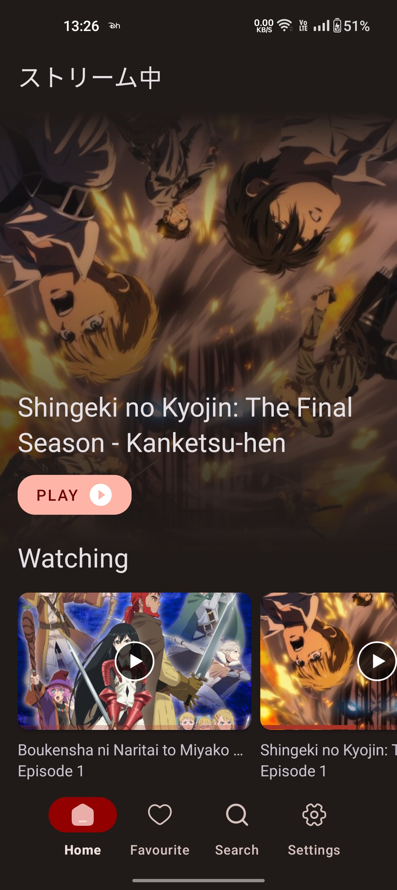](screenshot/dark_2.jpg)
[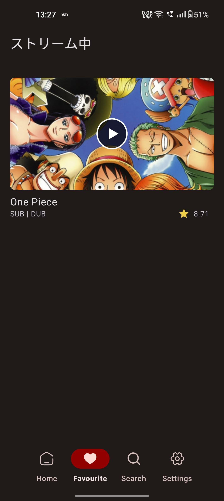](screenshot/dark_5.jpg)
[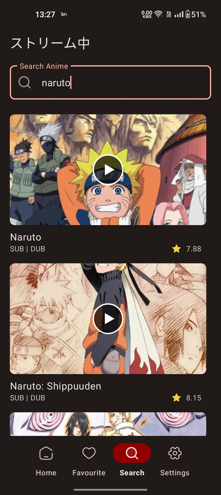](screenshot/dark_4.jpg)
[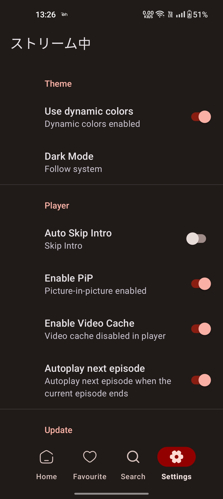](screenshot/dark_3.jpg)
[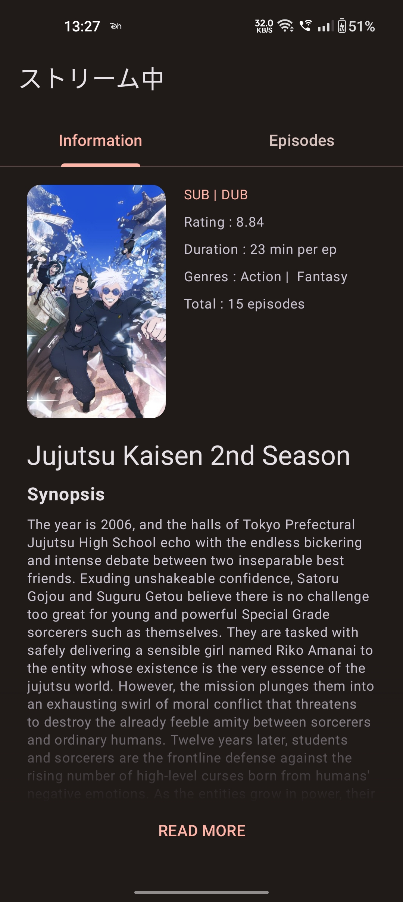](screenshot/dark_6.jpg)
[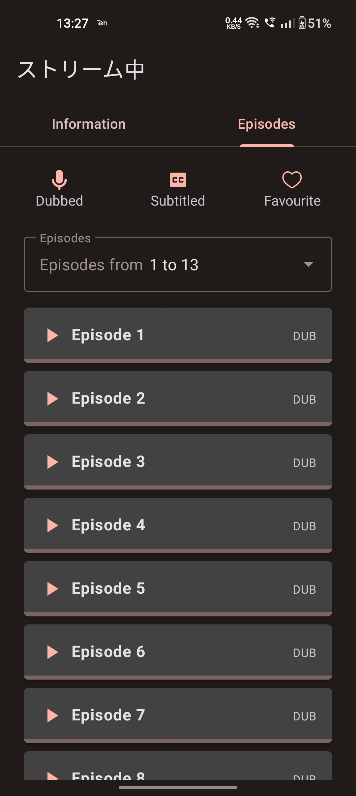](screenshot/dark_7.jpg)
[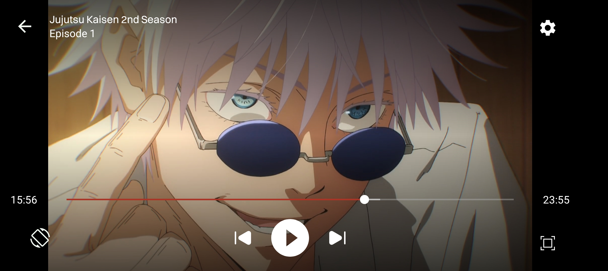](screenshot/dark_1.jpg)

## Light Theme
[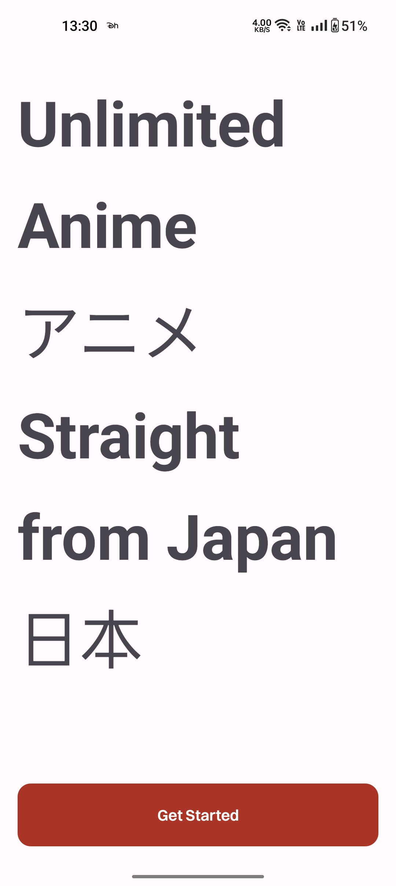](screenshot/light_8.jpg)
[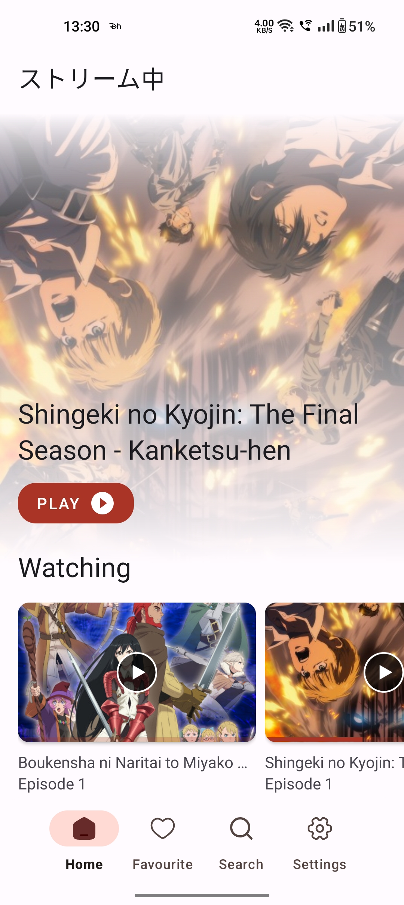](screenshot/light_5.jpg)
[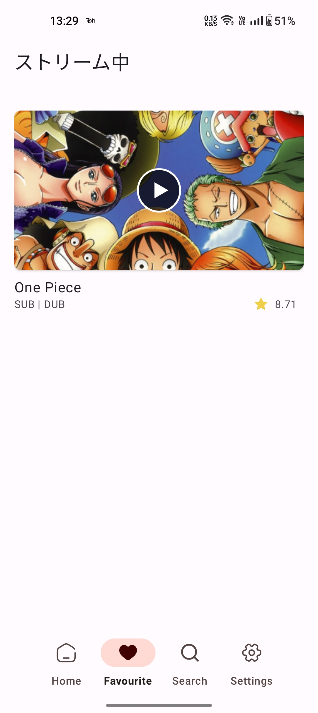](screenshot/light_4.jpg)
[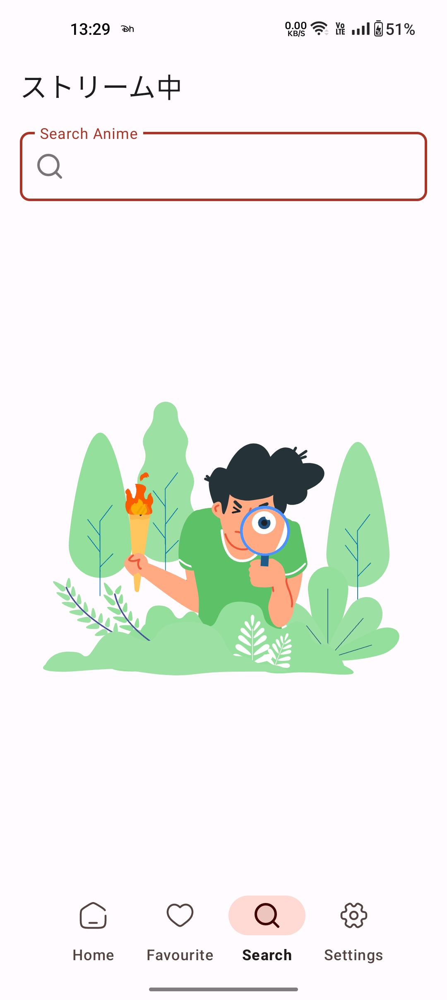](screenshot/light_3.jpg)
[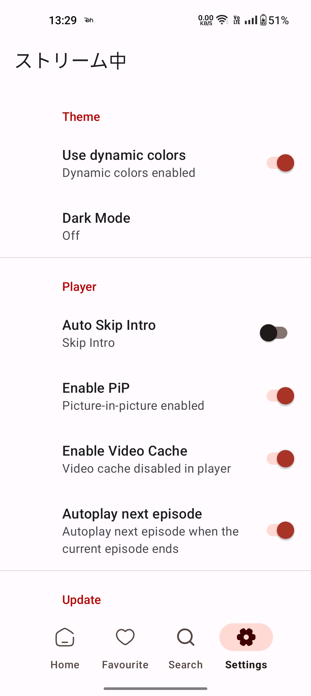](screenshot/light_2.jpg)
[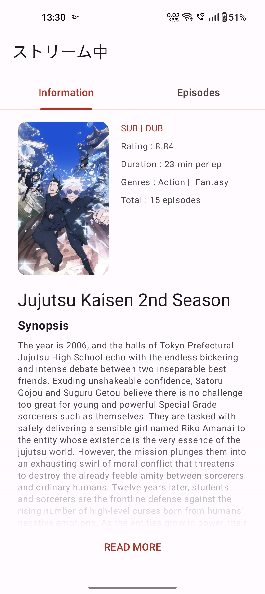](screenshot/light_6.jpg)
[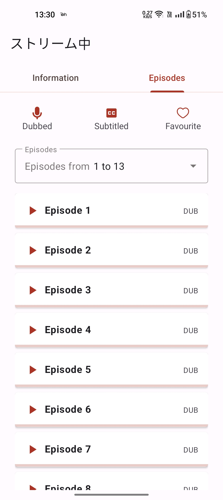](screenshot/light_7.jpg)

